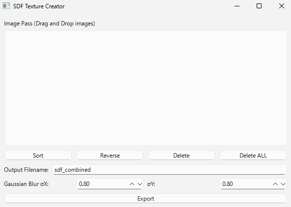

# SDF Texture Create Tool

Signed Distance Field (SDF) テクスチャを生成するためのツールです。  
フォントやシェイプのエッジをなめらかに表現したい場合や、拡大縮小に強いテクスチャが必要な場合に活用できます。

---

## 機能

- PNG画像からSDFテクスチャを自動生成
- GUIでDrag&Dropに対応
- Blur調整可能
- UE5 / Unity などのゲームエンジンで利用可能

---

